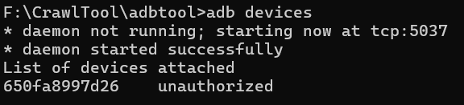
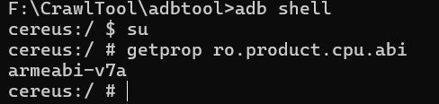
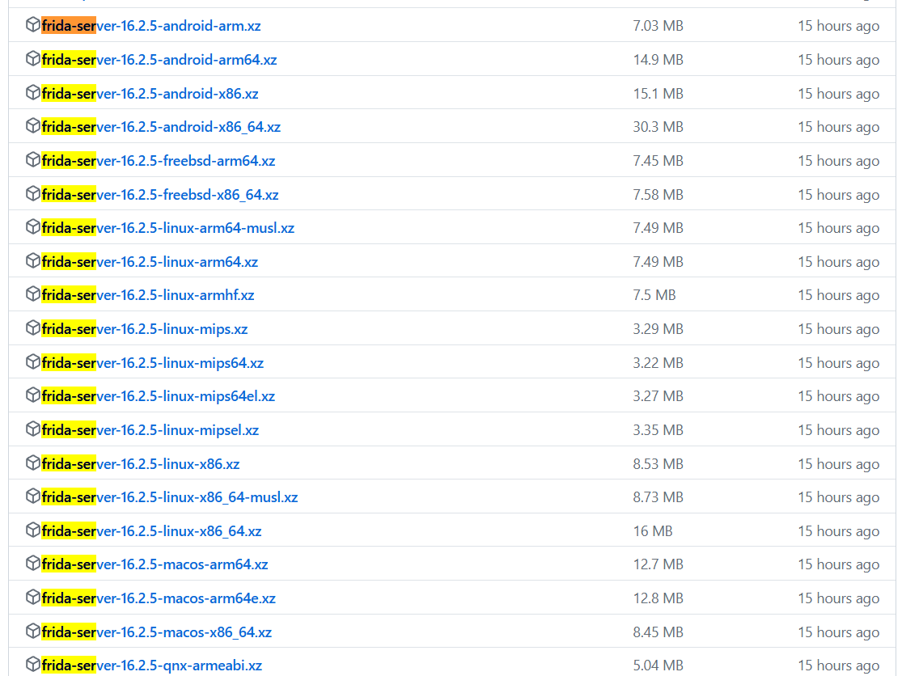
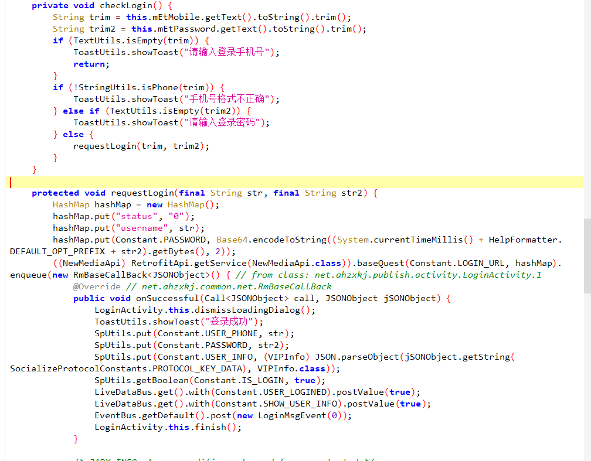

# FridaHook基础
> 需要先安装adb工具

手机开启USB调试,不同手机的开发者选项不一致,可以直接百度
## adb检查手机连接
手机开启USB调试后,通过数据线连接到电脑上后,可以通过`adb evices`查看

有的时候,这里会出现问题,没有内容,可以检查以下几个方面
>手机是否开启USB调试  
>传输方式时候是文件传输,默认是充电模式  
>数据线连接是否正常,换一根数据线试试  
>adb工具存在问题,可以尝试找一些模拟器自带的adb工具测试手机
## 手机安装Frida-server
[Frida-sever下载连接](https://github.com/frida/frida/releases)  
首先检查手机的CPU版本
> adb shell  
> getprop ro.product.cpu.abi


我这里的CPU版本是ARM32位的,很多模拟器是x86的,然后去网站中找自己需要的frida-server

将CPU版本对应的下载到本地上,然后将里面的内容解压缩,并重命名为frdia-server，然后使用adb命令进行推送
```cmd
adb push frdia-server /data/local/tmp
# /data/local/tmp是手机的路径
adb shell
su
cd /data/local/tmp
chmod 777 frdia-server
./frdia-server
# 正常情况下不会产生任何内容,此时frida-server已经成功启动了
```
## Python使用frida
### 安装Python第三方包
> pip install frida
### 打开转发接口
> adb forward tcp:27042 tcp:27042  
> adb forward tcp:27043 tcp:27043
### 通过jdax或其他工具检查apk,获取hook代码
> 以测试APP为例,Hook登录功能

### Python代码
```python
# 获取运行中的APP
import frida
import sys

# 获取设备信息

rdev = frida.get_usb_device()
print(rdev)

# test ok，如果用rdev就出错
process = rdev.enumerate_processes()
print(process)


# 获取在前台运行的APP
# test ok, 如果用rdev就出错
front_app = rdev.get_frontmost_application()
print(front_app)
```
```python
import frida, sys
def on_message(message, data):
    if message['type'] == 'send':
        print("[*] {0}".format(message['payload']))
    else:
        print(message)

jscode = """
Java.perform(() => {
  // 获取到hook的类
  const LoginActivity = Java.use('xxx.xxx.LoginActivity');
  // 类里面具体的某个函数
  const requestLogin = LoginActivity.requestLogin;
  // 创造钩子
  requestLogin.implementation = function (str, str2) {
    send('onClick');
    send(str)
    console.log(str2)
    requestLogin.call(this, str, str2);  // 要把代码在放回去,否则可能会出现APP崩溃
    console.log("hello");
  };
});
"""

process = frida.get_usb_device().attach('APP进程名称')
script = process.create_script(jscode)
script.on('message', on_message)
print('[*] Running CTF')
script.load()
sys.stdin.read()

```
### PythonHook的通用脚本
```python
import frida, sys
# 需要修改jscode和对应的启动内容就可以
def on_message(message, data):
    if message['type'] == 'send':
        print("[*] {0}".format(message['payload']))
    else:
        print(message)

jscode = """
Java.perform(() => {
  // Function to hook is defined here
  const MainActivity = Java.use('com.example.seccon2015.rock_paper_scissors.MainActivity');

  // Whenever button is clicked
  const onClick = MainActivity.onClick;
  onClick.implementation = function (v) {
    // Show a message to know that the function got called
    send('onClick');

    // Call the original onClick handler
    onClick.call(this, v);

    // Set our values after running the original onClick handler
    this.m.value = 0;
    this.n.value = 1;
    this.cnt.value = 999;

    // Log to the console that it's done, and we should have the flag!
    console.log('Done:' + JSON.stringify(this.cnt));
  };
});
"""

process = frida.get_usb_device().attach('com.example.seccon2015.rock_paper_scissors')
script = process.create_script(jscode)
script.on('message', on_message)
print('[*] Running CTF')
script.load()
sys.stdin.read()
```

